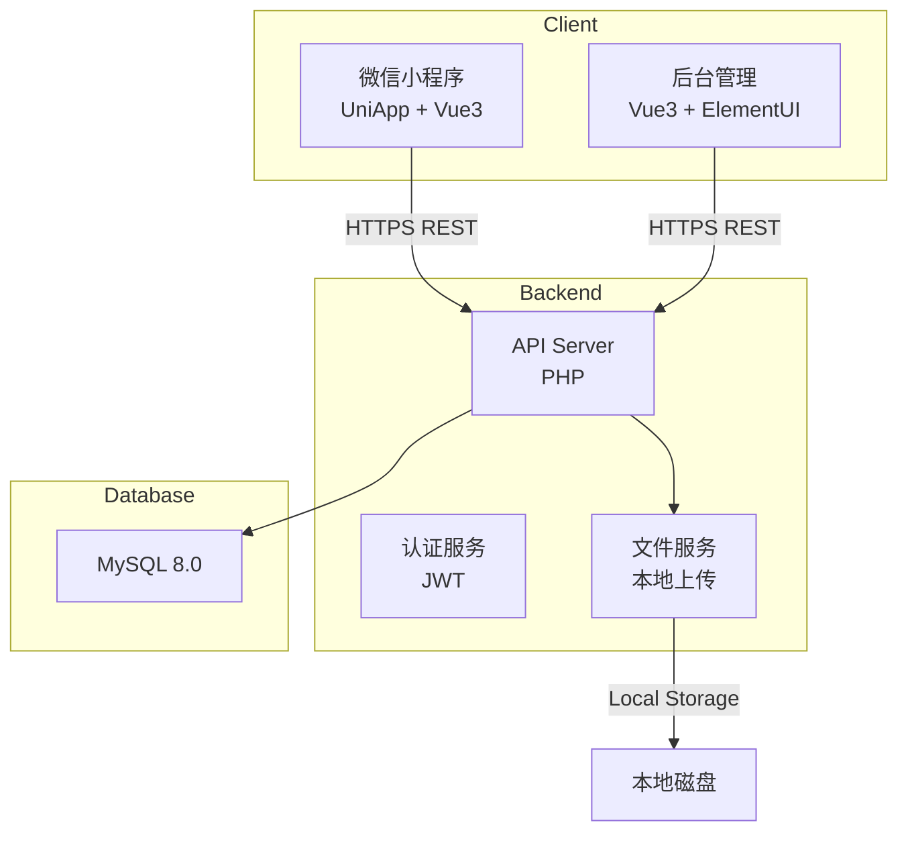
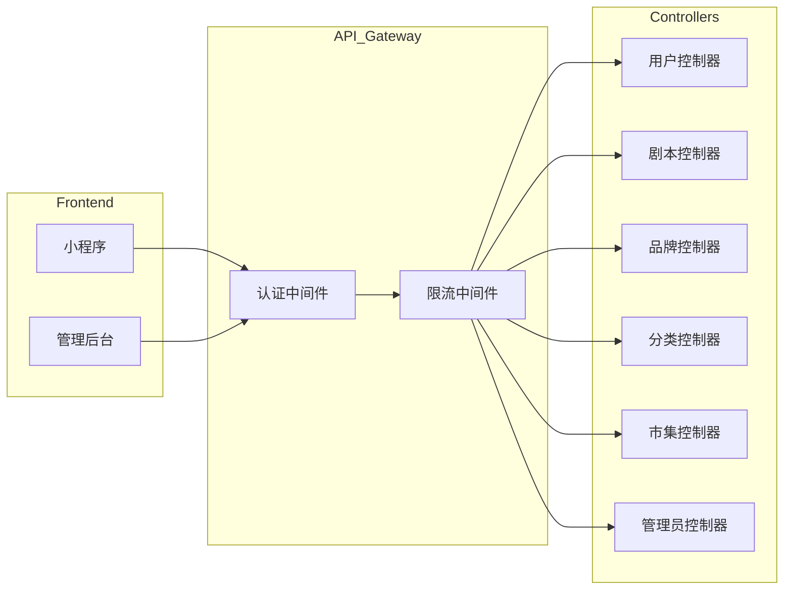
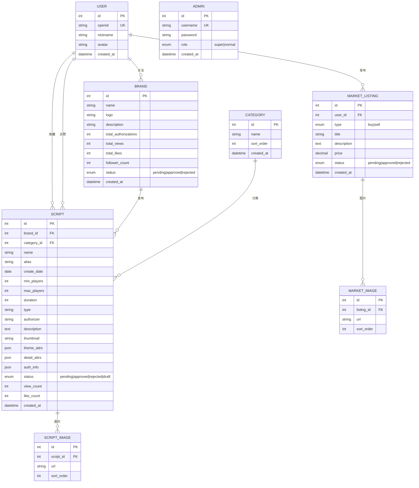
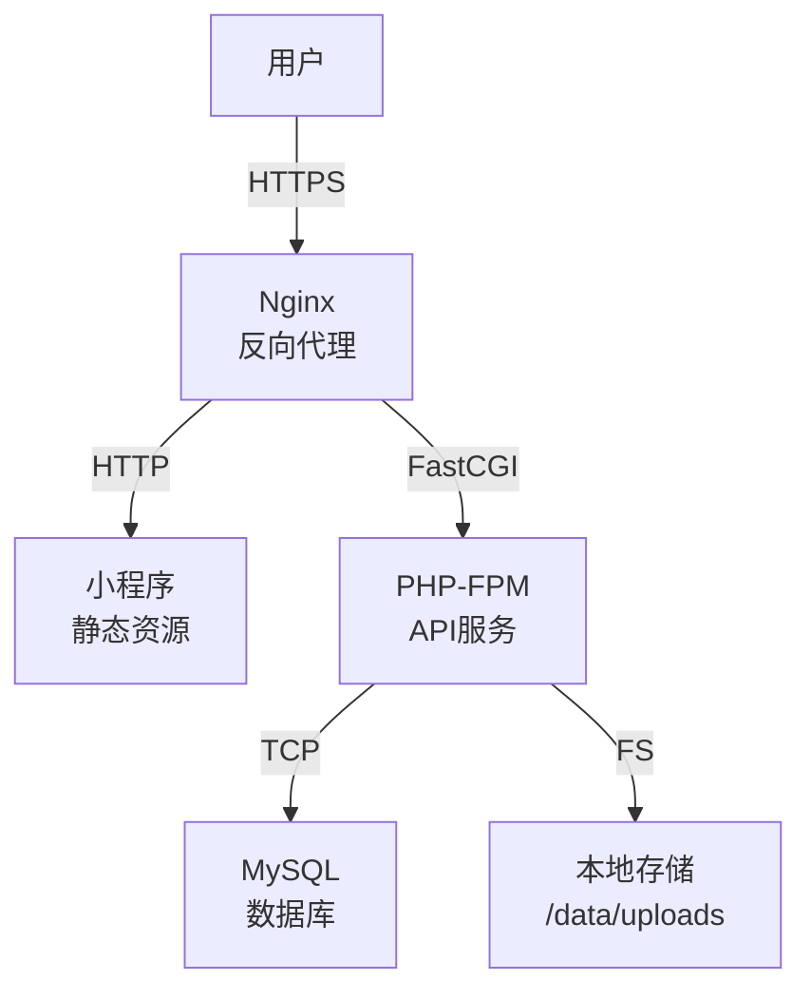

# 密室逃脱剧本展示系统 - 技术设计文档

Feature Name: escape-room-script-platform
Updated: 2026-04-06

## 1. 项目概述

### 1.1 项目背景

密室逃脱剧本展示系统是一个面向密室逃脱行业的 B2B 平台，旨在连接剧本创作者、品牌商和密室运营商。系统包含面向C端用户的小程序和面向B端商家/管理员的后台管理系统。

### 1.2 技术栈

| 层级    | 技术选型            |
| ----- | --------------- |
| 前端小程序 | UniApp + Vue3   |
| 后端API | PHP (thinkphp8) |
| 数据库   | MySQL 8.0       |
| 图片存储  | 本地存储            |

### 1.3 项目结构

```
escape-room-script-platform/
├── backend/                 # PHP 后端
│   ├── app/
│   │   ├── Controllers/     # 控制器
│   │   ├── Models/         # 数据模型
│   │   ├── Middleware/     # 中间件
│   │   └── Services/      # 业务逻辑
│   ├── config/            # 配置文件
│   ├── routes/            # 路由定义
│   ├── database/          # 数据库迁移
│   └── public/           # 入口文件
│
├── miniprogram/           # UniApp 小程序
│   ├── src/
│   │   ├── pages/         # 页面
│   │   ├── components/    # 组件
│   │   ├── static/        # 静态资源
│   │   ├── services/      # API 服务
│   │   ├── stores/        # 状态管理
│   │   └── utils/         # 工具函数
│   ├── manifest.json      # 小程序配置
│   └── pages.json         # 页面路由配置
│
└── admin/                  # 后台管理 Web (可选)
```

## 2. 系统架构

### 2.1 架构图



### 2.2 API 架构



## 3. 数据库设计

### 3.1 ER 图



### 3.2 数据表详细设计

#### 3.2.1 用户表 (user)

| 字段          | 类型           | 约束                  | 说明       |
| ----------- | ------------ | ------------------- | -------- |
| id          | INT          | PK, AUTO\_INCREMENT | 用户ID     |
| openid      | VARCHAR(64)  | UNIQUE, NOT NULL    | 微信openid |
| nickname    | VARCHAR(64)  | <br />              | 昵称       |
| avatar      | VARCHAR(255) | <br />              | 头像URL    |
| created\_at | DATETIME     | NOT NULL            | 创建时间     |

#### 3.2.2 品牌表 (brand)

| 字段                    | 类型           | 约束                  | 说明       |
| --------------------- | ------------ | ------------------- | -------- |
| id                    | INT          | PK, AUTO\_INCREMENT | 品牌ID     |
| name                  | VARCHAR(100) | NOT NULL            | 品牌名称     |
| logo                  | VARCHAR(255) | <br />              | Logo URL |
| description           | TEXT         | <br />              | 品牌简介     |
| total\_authorizations | INT          | DEFAULT 0           | 累计授权数    |
| total\_views          | INT          | DEFAULT 0           | 总浏览量     |
| total\_likes          | INT          | DEFAULT 0           | 总获赞      |
| follower\_count       | INT          | DEFAULT 0           | 关注人数     |
| status                | ENUM         | DEFAULT 'pending'   | 状态       |
| created\_at           | DATETIME     | NOT NULL            | 创建时间     |

#### 3.2.3 分类表 (category)

| 字段          | 类型          | 约束                  | 说明   |
| ----------- | ----------- | ------------------- | ---- |
| id          | INT         | PK, AUTO\_INCREMENT | 分类ID |
| name        | VARCHAR(50) | NOT NULL            | 分类名称 |
| sort\_order | INT         | DEFAULT 0           | 排序   |
| created\_at | DATETIME    | NOT NULL            | 创建时间 |

#### 3.2.4 剧本表 (script)

| 字段            | 类型           | 约束                  | 说明       |
| ------------- | ------------ | ------------------- | -------- |
| id            | INT          | PK, AUTO\_INCREMENT | 剧本ID     |
| brand\_id     | INT          | FK                  | 品牌ID     |
| category\_id  | INT          | FK                  | 分类ID     |
| name          | VARCHAR(100) | NOT NULL            | 剧本名称     |
| alias         | VARCHAR(100) | <br />              | 别名       |
| create\_date  | DATE         | <br />              | 创作日期     |
| min\_players  | INT          | NOT NULL            | 最少人数     |
| max\_players  | INT          | NOT NULL            | 最多人数     |
| duration      | INT          | NOT NULL            | 游戏时长(分钟) |
| type          | VARCHAR(50)  | <br />              | 剧本类型     |
| authorizer    | VARCHAR(100) | <br />              | 授权方      |
| description   | TEXT         | <br />              | 剧本简介     |
| thumbnail     | VARCHAR(255) | <br />              | 缩略图      |
| theme\_attrs  | JSON         | <br />              | 主题属性     |
| detail\_attrs | JSON         | <br />              | 详细信息     |
| auth\_info    | JSON         | <br />              | 授权信息     |
| status        | ENUM         | DEFAULT 'pending'   | 状态       |
| view\_count   | INT          | DEFAULT 0           | 浏览量      |
| like\_count   | INT          | DEFAULT 0           | 点赞数      |
| created\_at   | DATETIME     | NOT NULL            | 创建时间     |

**theme\_attrs JSON 结构:**

```json
{
  "story_score": 5,
  "puzzle_difficulty": 4,
  "sound_light_score": 5,
  "mechanism_score": 4,
  "puzzle_count": 20,
  "horror_level": 3,
  "npc_lines_score": 4,
  "performance_score": 5,
  "interaction_score": 4
}
```

**detail\_attrs JSON 结构:**

```json
{
  "room_size": "large",
  "room_count": 8,
  "corridor_count": 3,
  "construction_price": 500000,
  "mechanism_price": 200000,
  "area": 300,
  "player_type": "experienced"
}
```

**auth\_info JSON 结构:**

```json
{
  "auth_status": "authorized",
  "auth_services": ["full", "script_only", "scene_only"],
  "city_prices": {
    "tier1": 100000,
    "tier2": 80000,
    "tier3": 50000
  }
}
```

#### 3.2.5 剧本图片表 (script\_image)

| 字段          | 类型           | 约束                  | 说明    |
| ----------- | ------------ | ------------------- | ----- |
| id          | INT          | PK, AUTO\_INCREMENT | 图片ID  |
| script\_id  | INT          | FK                  | 剧本ID  |
| url         | VARCHAR(255) | NOT NULL            | 图片URL |
| sort\_order | INT          | DEFAULT 0           | 排序    |

#### 3.2.6 市集表 (market\_listing)

| 字段           | 类型            | 约束                  | 说明       |
| ------------ | ------------- | ------------------- | -------- |
| id           | INT           | PK, AUTO\_INCREMENT | 列表ID     |
| user\_id     | INT           | FK                  | 用户ID     |
| type         | ENUM          | NOT NULL            | buy/sell |
| title        | VARCHAR(100)  | NOT NULL            | 标题       |
| description  | TEXT          | <br />              | 描述       |
| price        | DECIMAL(10,2) | <br />              | 价格       |
| status       | ENUM          | DEFAULT 'pending'   | 状态       |
| is\_featured | TINYINT       | DEFAULT 0           | 是否精选     |
| created\_at  | DATETIME      | NOT NULL            | 创建时间     |

#### 3.2.7 市集图片表 (market\_image)

| 字段          | 类型           | 约束                  | 说明    |
| ----------- | ------------ | ------------------- | ----- |
| id          | INT          | PK, AUTO\_INCREMENT | 图片ID  |
| listing\_id | INT          | FK                  | 市集ID  |
| url         | VARCHAR(255) | NOT NULL            | 图片URL |
| sort\_order | INT          | DEFAULT 0           | 排序    |

#### 3.2.8 管理员表 (admin)

| 字段          | 类型           | 约束                  | 说明     |
| ----------- | ------------ | ------------------- | ------ |
| id          | INT          | PK, AUTO\_INCREMENT | 管理员ID  |
| username    | VARCHAR(50)  | UNIQUE, NOT NULL    | 用户名    |
| password    | VARCHAR(255) | NOT NULL            | 密码(加密) |
| role        | ENUM         | DEFAULT 'normal'    | 角色     |
| created\_at | DATETIME     | NOT NULL            | 创建时间   |

#### 3.2.9 用户互动表 (user\_interaction)

| 字段           | 类型       | 约束                  | 说明                  |
| ------------ | -------- | ------------------- | ------------------- |
| id           | INT      | PK, AUTO\_INCREMENT | ID                  |
| user\_id     | INT      | FK                  | 用户ID                |
| target\_type | ENUM     | NOT NULL            | script/brand        |
| target\_id   | INT      | NOT NULL            | 目标ID                |
| action\_type | ENUM     | NOT NULL            | like/collect/follow |
| created\_at  | DATETIME | NOT NULL            | 创建时间                |

## 4. API 接口设计

### 4.1 公共接口

#### 4.1.1 首页数据

```
GET /api/home
Response:
{
  "banners": [
    { "id": 1, "image": "url", "link": "script/1" }
  ],
  "ads": [
    { "id": 1, "image": "url", "link": "brand/1" }
  ],
  "scripts": [
    { "id": 1, "name": "xxx", "thumbnail": "url", "like_count": 100 }
  ]
}
```

#### 4.1.2 搜索剧本

```
GET /api/scripts/search?keyword=xxx&page=1&limit=20
Response:
{
  "total": 100,
  "list": [
    { "id": 1, "name": "xxx", "thumbnail": "url", "price_range": "5万-10万" }
  ]
}
```

#### 4.1.3 剧本详情

```
GET /api/scripts/{id}
Response:
{
  "id": 1,
  "name": "xxx",
  "alias": "xxx",
  "brand": { "id": 1, "name": "品牌名" },
  "category": { "id": 1, "name": "分类名" },
  "create_date": "2024-01-01",
  "min_players": 4,
  "max_players": 8,
  "duration": 90,
  "type": "恐怖",
  "description": "...",
  "thumbnail": "url",
  "theme_attrs": {},
  "detail_attrs": {},
  "auth_info": {},
  "images": [],
  "view_count": 1000,
  "like_count": 100,
  "is_liked": false
}
```

#### 4.1.4 分类列表

```
GET /api/categories
Response:
{
  "list": [
    { "id": 1, "name": "恐怖", "count": 50 }
  ]
}
```

#### 4.1.5 分类筛选剧本

```
GET /api/categories/{id}/scripts?filters=...
Response:
{
  "ads": [],
  "scripts": [],
  "filters": {
    "price_range": [...],
    "players": [...],
    "horror_level": [...]
  }
}
```

#### 4.1.6 品牌列表

```
GET /api/brands?page=1&limit=20
Response:
{
  "total": 50,
  "list": [
    { "id": 1, "name": "品牌名", "logo": "url", "follower_count": 1000 }
  ]
}
```

#### 4.1.7 品牌详情

```
GET /api/brands/{id}
Response:
{
  "id": 1,
  "name": "品牌名",
  "logo": "url",
  "description": "...",
  "total_authorizations": 100,
  "total_views": 50000,
  "total_likes": 2000,
  "follower_count": 1000,
  "is_followed": false,
  "hot_scripts": [],
  "all_scripts": []
}
```

#### 4.1.8 市集列表

```
GET /api/market?type=buy|sell&page=1&limit=20
Response:
{
  "featured": [],
  "listings": [],
  "official_picks": []
}
```

### 4.2 用户接口（需登录）

```
POST /api/user/login     # 微信登录
POST /api/scripts/{id}/like     # 点赞剧本
POST /api/scripts/{id}/collect  # 收藏剧本
POST /api/brands/{id}/follow    # 关注品牌
GET  /api/user/favorites         # 我的收藏
GET  /api/user/follows           # 我的关注
POST /api/market/listings        # 发布市集内容
```

### 4.3 管理后台接口

#### 4.3.1 管理员

```
POST   /api/admin/login           # 管理员登录
POST   /api/admin/logout          # 退出登录
GET    /api/admin/profile         # 管理员信息
PUT    /api/admin/password        # 修改密码
```

#### 4.3.2 管理员管理

```
GET    /api/admin/admins          # 管理员列表
POST   /api/admin/admins          # 添加管理员
PUT    /api/admin/admins/{id}     # 更新管理员
DELETE /api/admin/admins/{id}     # 删除管理员
```

#### 4.3.3 分类管理

```
GET    /api/admin/categories      # 分类列表
POST   /api/admin/categories      # 添加分类
PUT    /api/admin/categories/{id} # 更新分类
DELETE /api/admin/categories/{id} # 删除分类
```

#### 4.3.4 品牌管理

```
GET    /api/admin/brands          # 品牌列表（待审核/已审核）
PUT    /api/admin/brands/{id}/audit # 审核品牌
GET    /api/admin/brands/{id}     # 品牌详情
```

#### 4.3.5 剧本管理

```
GET    /api/admin/scripts         # 剧本列表
POST   /api/admin/scripts         # 添加剧本
PUT    /api/admin/scripts/{id}   # 更新剧本
DELETE /api/admin/scripts/{id}   # 删除剧本
PUT    /api/admin/scripts/{id}/audit # 审核剧本
PUT    /api/admin/scripts/{id}/restore # 恢复剧本
DELETE /api/admin/scripts/{id}/permanent # 永久删除
```

#### 4.3.6 市集管理

```
GET    /api/admin/market/listings      # 市集列表
PUT    /api/admin/market/listings/{id}/audit # 审核
DELETE /api/admin/market/listings/{id} # 删除
PUT    /api/admin/market/listings/{id}/featured # 标记精选
```

#### 4.3.7 数据统计

```
GET /api/admin/stats/overview     # 总体统计
GET /api/admin/stats/trend        # 趋势数据
```

#### 4.3.8 首页内容管理

```
GET    /api/admin/home/banners    # 轮播图列表
POST   /api/admin/home/banners   # 添加轮播图
PUT    /api/admin/home/banners/{id}
DELETE /api/admin/home/banners/{id}

GET    /api/admin/home/ads        # 广告位列表
POST   /api/admin/home/ads        # 添加广告
PUT    /api/admin/home/ads/{id}
DELETE /api/admin/home/ads/{id}
```

## 5. 前端页面结构

### 5.1 小程序页面

```
pages/
├── index/                    # 首页
│   ├── index.vue
│   └── components/
│       ├── Banner.vue        # 轮播图组件
│       ├── AdBanner.vue      # 广告位组件
│       └── ScriptCard.vue    # 剧本卡片组件
│
├── search/                   # 搜索页
│   └── search.vue
│
├── category/                 # 分类页
│   ├── category.vue
│   └── components/
│       ├── FilterPanel.vue   # 筛选面板
│       └── ScriptList.vue    # 剧本列表
│
├── brand/                    # 品牌相关
│   ├── brand-list.vue        # 品牌列表
│   ├── brand-detail.vue       # 品牌详情
│   └── components/
│       └── BrandCard.vue
│
├── market/                   # 市集页
│   ├── market.vue
│   └── components/
│       ├── ListingCard.vue   # 交易卡片
│       └── PublishForm.vue   # 发布表单
│
├── script/                   # 剧本详情
│   ├── script-detail.vue
│   └── components/
│       ├── ImageGallery.vue  # 图片画廊
│       ├── AttrTable.vue      # 属性表格
│       └── AuthPrice.vue      # 授权价格
│
└── user/                     # 用户中心
    ├── user.vue
    └── pages/
        ├── favorites.vue     # 我的收藏
        ├── follows.vue       # 我的关注
        └── publish.vue       # 发布管理
```

### 5.2 页面路由

```json
{
  "pages": [
    { "path": "pages/index/index" },
    { "path": "pages/search/search" },
    { "path": "pages/category/category" },
    { "path": "pages/brand/brand-list" },
    { "path": "pages/brand/brand-detail" },
    { "path": "pages/market/market" },
    { "path": "pages/script/script-detail" },
    { "path": "pages/user/user" }
  ],
  "subPackages": [
    {
      "root": "pages/user",
      "pages": ["favorites", "follows", "publish"]
    }
  ],
  "tabBar": {
    "list": [
      { "pagePath": "pages/index/index", "text": "首页", "icon": "home" },
      { "pagePath": "pages/category/category", "text": "分类", "icon": "category" },
      { "pagePath": "pages/brand/brand-list", "text": "品牌", "icon": "brand" },
      { "pagePath": "pages/market/market", "text": "市集", "icon": "market" },
      { "pagePath": "pages/user/user", "text": "我的", "icon": "user" }
    ]
  }
}
```

## 6. 后端目录结构 (PHP)

```
backend/
├── app/
│   ├── Controllers/
│   │   ├── HomeController.php
│   │   ├── ScriptController.php
│   │   ├── BrandController.php
│   │   ├── CategoryController.php
│   │   ├── MarketController.php
│   │   ├── UserController.php
│   │   └── Admin/
│   │       ├── AuthController.php
│   │       ├── AdminController.php
│   │       ├── ScriptController.php
│   │       ├── BrandController.php
│   │       ├── CategoryController.php
│   │       ├── MarketController.php
│   │       ├── StatsController.php
│   │       └── HomeContentController.php
│   │
│   ├── Models/
│   │   ├── User.php
│   │   ├── Brand.php
│   │   ├── Script.php
│   │   ├── Category.php
│   │   ├── MarketListing.php
│   │   ├── Admin.php
│   │   └── UserInteraction.php
│   │
│   ├── Middleware/
│   │   ├── AuthMiddleware.php
│   │   ├── AdminMiddleware.php
│   │   └── CorsMiddleware.php
│   │
│   └── Services/
│       ├── ScriptService.php
│       ├── BrandService.php
│       ├── MarketService.php
│       └── StatsService.php
│
├── config/
│   ├── database.php
│   ├── app.php
│   └── upload.php
│
├── routes/
│   ├── api.php
│   └── admin.php
│
├── database/
│   └── migrations/
│       └── 001_initial_schema.sql
│
├── public/
│   ├── index.php
│   └── uploads/           # 上传文件目录
│       ├── scripts/
│       ├── brands/
│       └── market/
│
└── bootstrap/
    └── app.php
```

## 7. 安全设计

### 7.1 认证与授权

1. **微信登录**: 使用微信 OAuth2.0 获取 openid
2. **管理员登录**: Session + Token 双认证
3. **接口访问控制**: 基于角色的权限控制 (RBAC)

### 7.2 数据安全

1. **密码加密**: 使用 bcrypt 或 Argon2
2. **SQL注入防护**: 使用预处理语句 (Prepared Statements)
3. **XSS防护**: 输出转义
4. **CSRF防护**: Token 验证

### 7.3 文件上传安全

1. **文件类型验证**: 仅允许 jpg, png, gif
2. **文件大小限制**: 单文件 10MB
3. **文件名重命名**: 使用 UUID 避免冲突
4. **存储隔离**: 上传文件与代码目录分离

## 8. 性能优化

### 8.1 后端优化

1. **数据库索引**: 针对常用查询字段建立索引
2. **缓存**: 使用 Redis 缓存热点数据
3. **分页**: 所有列表接口必须分页
4. **图片压缩**: 上传时自动压缩

### 8.2 前端优化

1. **分包加载**: 按页面进行分包
2. **图片懒加载**: 非首屏图片延迟加载
3. **本地缓存**: 使用 localStorage 缓存数据

## 9. 部署架构



## 10. 开发计划

### 阶段一：基础功能 (2周)

1. 项目初始化（数据库、框架搭建）
2. 管理员登录和管理功能
3. 分类管理
4. 基础 API 接口

### 阶段二：核心功能 (3周)

1. 品牌入驻和审核
2. 剧本发布和管理
3. 首页/分类/搜索功能
4. 小程序基础页面

### 阶段三：互动和市集 (2周)

1. 用户登录和互动功能
2. 市集求购/出售
3. 数据统计

### 阶段四：优化上线 (1周)

1. 性能优化
2. 安全加固
3. 测试和部署

**预计总工期: 8周**
